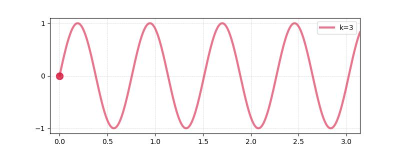
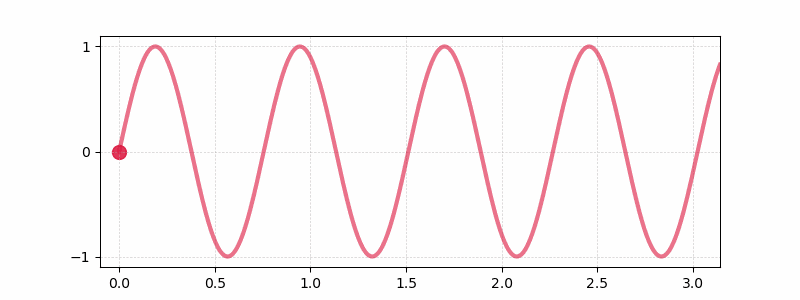
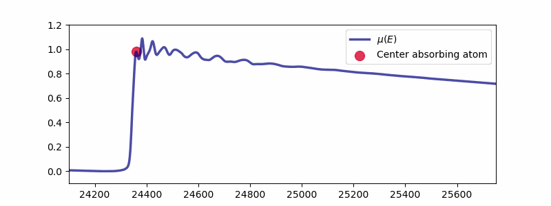
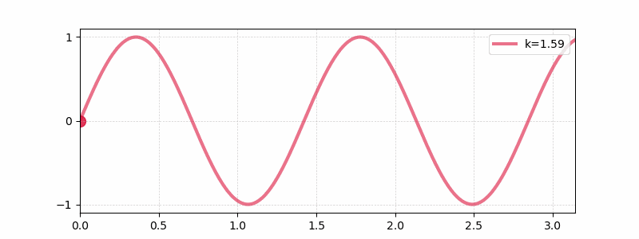
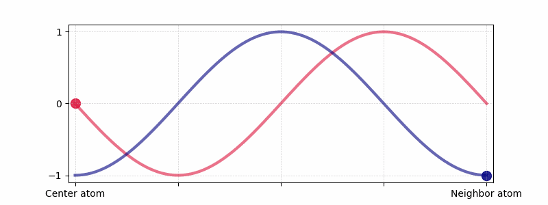
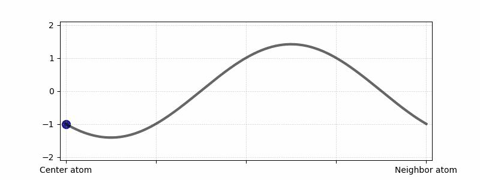
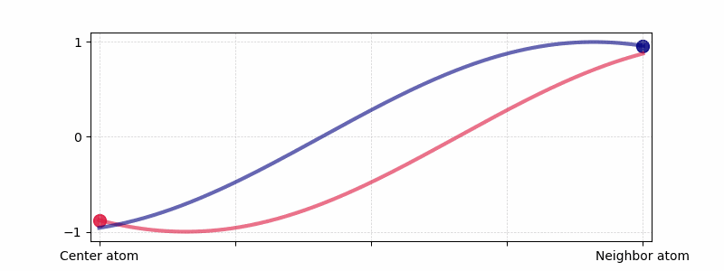
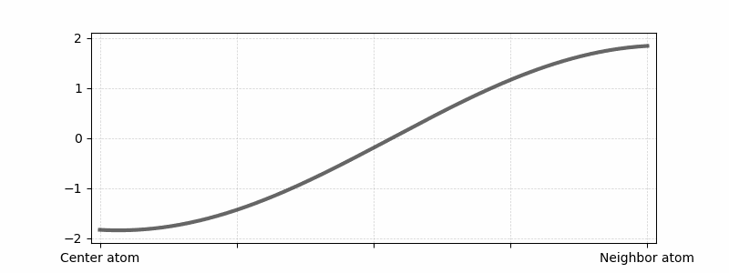

# XAFS_animations

Adapted from example: https://dododas.github.io/posts/2021/2021-01-17-matplotlib-waves/ (author: Raibatak Das)

- Juanjuan Huang & Shelly Kelly
- Argonne National Laboratory
- 2024

  

---

---

---

